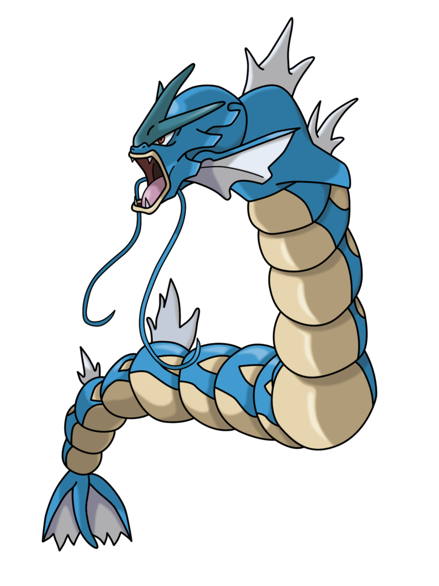
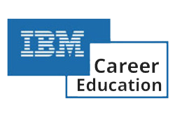

## About me

- 🔭 Computer Science @ **Universidad de Costa Rica** (2026).
- 🌱 Learning about full stack development and data engineering @ **IBM** (2025)!
- 😄 I enjoy programming and solving problems. Some of my projects can be found here!

  
  &nbsp;linkedin.com/in/quiann-zolfaghari/

  

___

  
  

___
